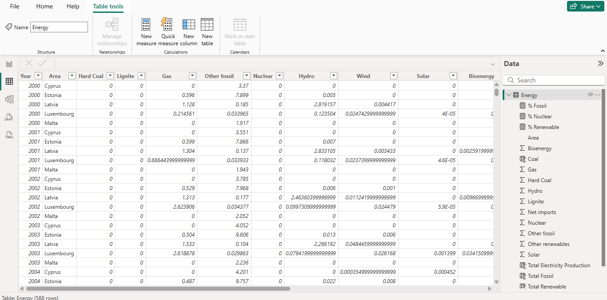
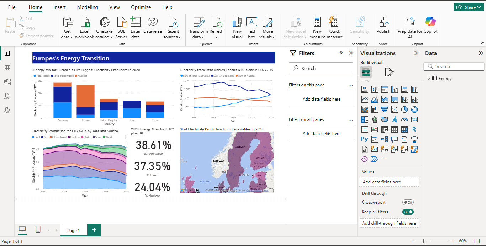
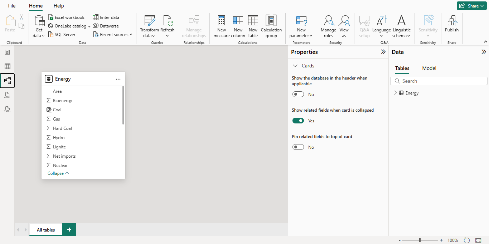

# PowerBI-Energy-Visualization
Power BI dashboard analyzing European energy generation and consumption (2000–2020)

This repository contains my first Power BI dashboard, created as part of the **Advanced Statistics and Data Visualization** module in my MSc Data Science at the University of Salford.  

## 📊 Overview of Data
The dataset for this dashboard was taken from **Makeover Monday**, a data visualization community project:  
👉 https://www.makeovermonday.co.uk/  

Makeover Monday provides weekly datasets for individuals to practice and share visualizations. This dataset summarizes **European energy production and consumption from 2000–2020**, covering all EU countries plus the UK.  

- **Each row** = country + year  
- **Columns** = energy produced (TWh) in categories:  
  - Hard Coal  
  - Lignite  
  - Gas  
  - Other Fossil  
  - Nuclear  
  - Hydro  
  - Wind  
  - Solar  
  - Bioenergy  
  - Other Renewables  
  - Net Imports  

The goal was to create a **simple one-page dashboard** showing the current (2020) energy mix across the EU & UK, and historical trends.  

## 📈 Dashboard Visualizations
1. **Stacked Area Chart** – Energy generation trends (2000–2020).  
2. **Cards (KPIs)** – % Renewable, % Fossil, and % Nuclear (2020).  
3. **Filled Map** – % Renewable contribution by country (2020).  
4. **KPI Summary** – Key indicators for the latest year.  

## 🔍 Key Insights
- Renewables increased steadily over 20 years.  
- By 2020, renewables formed a significant share of the EU/UK energy mix.  
- Regional differences highlight varying adoption of renewable sources.  

## ⚙️ Tools Used
- **Power BI** → dashboard creation  
- **Excel** → dataset handling  
- **Data Visualization** → storytelling with charts, maps, and KPIs  

## 📂 Repository Files
- `Energy_generation - Dashboard 1.xlsx` → Dataset  
- `energydashboard.pbix` → Power BI dashboard file

## 📸 Dashboard Screenshots  

### 🔹 Table View  
  

### 🔹 Report View  
  

### 🔹 Model View  

## ▶️ How to Use
1. Clone/download the repository.  
2. Open `energydashboard.pbix` in Power BI Desktop.  
3. Interact with filters, cards, and visuals for insights.

## 🔗 Related Links
- [Makeover Monday Project](https://www.makeovermonday.co.uk/)  
- [LinkedIn Post][(https://www.linkedin.com/posts/divya-p-j_powerbi-datascience-datavisualization-activity-7376981599080361985-Pweu?utm_source=share&utm_medium=member_desktop&rcm=ACoAADkZb5cBcBX26UuFhb1ctPXdJmdNI6Iaubc)]  

---
